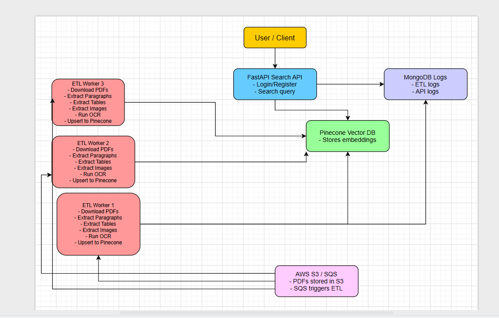

# flowautomate_backend

## Project Approach

The project was implemented in **two main parts**, each addressing a separate concern for modularity and scalability.

### 1. ETL Worker (Scalable & Automated)
- PDFs are uploaded to **AWS S3**.  
- **AWS SQS** is used to trigger the processing of new PDFs.  
- Multiple ETL workers pick up messages concurrently to handle high volumes of PDFs.  
- Each worker performs the following tasks:
  - Extracts **paragraphs** from PDFs.  
  - Extracts **tables** and converts them into structured JSON.  
  - Extracts **images** and runs **OCR** (image handling is designed for future implementation).  
- Extracted content is sent to **Pinecone**, which automatically handles **vector embeddings** for semantic search.  
- The pipeline is **fully automated**, scalable, and capable of processing PDFs without manual intervention.

### 2. FastAPI Search API with RAG
- Provides a **secure API interface** for querying PDF content.  
- Uses a **RAG (Retrieval-Augmented Generation) approach**:
  - Retrieves relevant content from **Pinecone**.  
  - Processes retrieved content with an **LLM layer via Groq API** for context-aware responses.  
- The system exposes **three APIs**:
  1. **Login:** Authenticates users and issues access tokens.  
  2. **Register:** Allows new users to register securely.  
  3. **Search:** Accepts user queries and returns results using the RAG approach.  
- Returns **metadata** such as PDF ID, page number, and content snippet for proper context.  
- **Rate limiting** is applied to maintain consistency and prevent abuse.  
- Secured using **OAuth2 / JWT tokens** to allow access only to authorized users.

### 3. Logging & Monitoring
- **MongoDB** is used for centralized logging:
  - ETL worker activities (PDF processed, status, errors).  
  - API requests (query, user info, timestamp).  
- Logging ensures **transparency**, aids in **debugging**, and supports monitoring of multiple concurrent workers.

---

## Assumptions
1. **PDF Volume:** The system is expected to handle **100–500 PDFs** initially.  
2. **Diverse PDF Content:** PDFs may contain **varied structures** including paragraphs, tables, and images.  
3. **Pipeline Automation:** The ETL pipeline is **fully automated**, requiring minimal manual intervention.  
4. **Scalability:** Multiple ETL workers can run concurrently to process PDFs efficiently.  
5. **Cloud Services:** AWS services such as **S3** (for storage) and **SQS** (for messaging) are used for automation and scalability.  
6. **Backend Focus:** The project focuses on **backend processing, search indexing, and secure API development** rather than frontend UI.  
7. **Future Image Support:** While images are not fully integrated yet, the system is designed with the potential to **map images from S3 with search results** in the future.  
8. **Search Indexing:** **Pinecone** is used for vector search, which handles embedding creation automatically, reducing complexity.  

---
### Project Architecture




## ETL Worker Approach & Implementation

The ETL worker was designed to **process PDFs efficiently and prepare content for semantic search**. The approach focused on modularity, scalability, and preparing structured content for RAG-based querying.

### Implementation Steps
1. **PDF Extraction:**
   - Extracted **paragraphs** using Python-based parsers.  
   - Extracted **tables** separately and structured them into JSON.  
   - Extracted **images** with OCR for potential future use.  

2. **Content Separation & Indexing:**
   - Paragraphs, tables, and images are stored in **different namespaces** in Pinecone.  
   - This allows feeding content separately to **bots or LLMs** for better contextual understanding and decision-making.  
   - Used **LangChain** to manage chain of processing and retrieval.  

3. **Automation & Scalability:**
   - Multiple ETL workers process messages from **AWS SQS** concurrently.  
   - Fully automated pipeline ensures PDFs are indexed without manual intervention.  

### Advantages
- Allows **RAG-based search** with content split for more accurate responses.  
- Supports **high-volume processing** due to scalable worker design.  
- Prepares structured data in Pinecone for both paragraphs and tables, enabling **LLM-based reasoning**.  

### Limitations
- Image processing is not fully integrated yet, OCR results are stored but not actively used in search.  
- Maintaining separate namespaces for paragraphs, tables, and images adds some **complexity in management**.  
- Initial PDF parsing can be slower for very large or complex documents.  

---

## Setup Instructions

```bash
# 1. Clone the repository
git clone <repo_url>
cd <repo_name>

# 2. Create and activate virtual environment (Python 3.10+ recommended)
python -m venv venv
source venv/bin/activate   # Linux/Mac
venv\Scripts\activate      # Windows

# 3. Install required dependencies
pip install -r requirements.txt

# Additional installs
pip install pytesseract pillow opencv-python   # for OCR
pip install boto3                              # for AWS S3
pip install langchain GROQ pinecone-client     # for RAG embeddings

# 4. Install and configure AWS CLI
pip install awscli
aws configure
# Provide your AWS Access Key, Secret Key, Region

# 5. Upload sample data to S3
python sample_uploader.py

# 6. Generate embeddings and push to Pinecone
python main.py

# 7. Setup backend environment
# Create a `.env` file with:
#   MONGO_URL=<your_mongodb_url>
#   GROQ_API_KEY=<your_openai_key>
#   PINECONE_API_KEY=<your_pinecone_key>

# 8. Run FastAPI app
uvicorn app.main:app --reload --port 8000

# 9. Features:
# - Register/Login
# - Upload documents (PDFs, tables, images)
# - Search with RAG (retrieval augmented generation)
